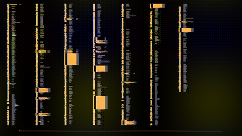

# OpcodeOracle

AI-assisted MOS 6502 disassembler for Commodore 64 binaries.

OpcodeOracle combines flow-following disassembly with AI-powered reverse engineering. It automatically classifies code and data regions, traces execution paths from entry points, and generates readable assembly output. An integrated MCP server lets you connect Claude (or any MCP client) to annotate, label, and understand disassembled code interactively.

An agent at work reverse engineering a disassembly:



## Quick Start

```bash
# Build
cd src && go build -o opcodeoracle ./cmd/opcodeoracle

# Create a project from a C64 PRG file
./opcodeoracle new prg game.prg --entry '$080D'

# See project summary
./opcodeoracle info game.opcodeoracle.json

# Export assembly
./opcodeoracle export game.opcodeoracle.json
# Creates: game.asm
```

## Commands

| Command   | Description                                        |
|-----------|----------------------------------------------------|
| `new`     | Create project from binary (`bin`, `prg`, or `sid`) |
| `info`    | Display project statistics                         |
| `export`  | Export to assembly file                            |
| `edit`    | Edit symbols, annotations, headlines, regions      |
| `mcp`     | Start MCP server (stdio or HTTP)                   |
| `chat`    | Interactive chat with AI assistant                 |
| `agent`   | Run AI agent for automated analysis               |

## Creating a Project

OpcodeOracle supports three input formats. Each creates a `.opcodeoracle.json` state file that tracks all disassembly data.

### C64 PRG file

The 2-byte load address is read from the file header:

```bash
./opcodeoracle new prg game.prg --entry '$080D'
```

### Raw binary

Specify origin and entry point(s) manually:

```bash
./opcodeoracle new bin firmware.bin --origin '$E000' --entry '$E000,$FFFC'
```

### SID music file

Entry points are extracted from the SID header automatically:

```bash
./opcodeoracle new sid music.sid
```

All `new` commands accept an optional `--description` flag:

```bash
./opcodeoracle new prg game.prg --entry '$080D' --description "Stunt Car Racer for the C64"
```

## AI-Assisted Reverse Engineering

### MCP Server

Start the MCP server to connect to any MCP-compatible client:

```bash
# Stdio transport (for Claude Desktop)
./opcodeoracle mcp game.opcodeoracle.json

# HTTP transport
./opcodeoracle mcp --transport http --listen 127.0.0.1:8080 game.opcodeoracle.json
```

MCP configuration:

```json
{
  "mcpServers": {
    "opcodeoracle": {
      "command": "/path/to/opcodeoracle",
      "args": ["mcp", "game.opcodeoracle.json"]
    }
  }
}
```

The MCP server exposes these tools:

| Tool                                          | Description                          |
|-----------------------------------------------|--------------------------------------|
| `view_disassembly`                            | View disassembled code at an address |
| `search_disassembly`                          | Search through disassembly output    |
| `add_symbol` / `remove_symbol`                | Manage named symbols                 |
| `add_annotation` / `remove_annotation`        | Add inline comments              |
| `add_headline` / `remove_headline`            | Add section headers                  |
| `reinterpret_as_code` / `reinterpret_as_data` | Reclassify regions      |
| `query_symbols`                               | Search the symbol table              |
| `query_xrefs`                                 | Find cross-references                |
| `list_subroutines_and_data_segments`          | Overview of all segments           |
| `get_subroutine_context`                      | Detailed subroutine analysis         |

### Chat and Agent Modes

For quick interactive sessions or fully automated analysis:

```bash
# Interactive chat
./opcodeoracle chat game.opcodeoracle.json

# Automated agent analysis
./opcodeoracle agent game.opcodeoracle.json
```

## Recommended Workflow

1. **Set up a project folder** with the `opcodeoracle` binary and your target binary side by side:

   ```
   myproject/
   ├── opcodeoracle
   └── game.prg
   ```

2. **Create the project** to run initial flow analysis:

   ```bash
   ./opcodeoracle new prg game.prg --entry '$080D' --description "My C64 game"
   ```

3. **Export the initial disassembly** to see what automatic analysis found:
   
   ```bash
   ./opcodeoracle export game.opcodeoracle.json
   ```

4. **Start the MCP server** and connect your AI chatbot:

   ```bash
   ./opcodeoracle mcp game.opcodeoracle.json
   ```

5. **Begin the conversation** with a prompt like:

   > Use the `list_subroutines_and_data_segments` tool to get an overview of the binary.
   > Then pick a subroutine, view its disassembly, and start adding symbols and annotations.
   > After each subroutine, suggest what to look at next.

   The AI will iteratively explore the code, name subroutines and variables, annotate logic, and identify data structures. You can guide it or let it work through the binary systematically.

6. **Export again** at any point to see the updated assembly with all AI-generated names and annotations:

   ```bash
   ./opcodeoracle export game.opcodeoracle.json
   ```

## Sample Output

Exported assembly from a SID music file, showing symbols, cross-references, and AI-generated annotations:

```asm
$C040 copy_data_block:                ; xref: branch from $C045
                                      ; xref: branch from $C04C
                                      ; xref: call from $C015
    LDA ($FB),Y                       ; src_ptr_LO
    STA ($FD),Y                       ; dst_ptr_LO
    INY
    BNE $C040                         ; Branch to copy_data_block
    INC $FC                           ; src_ptr_HI
    INC $FE                           ; dst_ptr_HI
    DEX
    BNE $C040                         ; Branch to copy_data_block
$C04E copy_remaining_bytes:           ; xref: branch from $C055
    LDA ($FB),Y                       ; src_ptr_LO
    STA ($FD),Y                       ; dst_ptr_LO
    INY
    CPY #$02
    BNE $C04E                         ; Branch to copy_remaining_bytes
    RTS

; === DATA SECTION ===

; --------------------------------------------------------
; Unused alternate entry points and register save/restore
; routines (dead code).
; --------------------------------------------------------
$C058                   .BYTE $AB,$C0,$20,$2B,$C0,$58,$60,$20

; === SUBROUTINE: music_play ===

; --------------------------------------------------------
; Music play entry point - called once per frame.
; Banks in I/O, processes one tick of the music engine,
; then restores banking.
; --------------------------------------------------------
$C09F music_play:
    JSR $C033                         ; Call enable_io_ram
                                      ; Bank in I/O for SID register access
    JSR $C16F                         ; Call play_tick
                                      ; Process one music tick
    JMP $C02B                         ; Jump to restore_rom_banking
                                      ; Restore banking and return
```

## Example Info Output

```
Project:       Nippon.opcodeoracle.json
Source:        testdata/Nippon.sid
Created:       2026-02-06 19:36:45
Modified:      2026-02-08 22:30:18
Origin:        $B8F8
Binary:        $B8F8 - $CCC9 (5074 bytes)
Entry points:  $C000, $C09F
Symbols:       338
  Subroutine:  32
  Label:       165
  Byte:        141
Annotations:   223
  Assistant:   223
Headlines:     86
  Assistant:   86
Regions:       29
  Code:        2310 bytes (14 regions)
  Data:        2764 bytes (15 regions)
```

## Number Format

All address and numeric parameters accept three formats:

| Format | Example  |
|--------|----------|
| `$hex` | `$C000`  |
| `0xhex`| `0xC000` |
| decimal| `49152`  |

