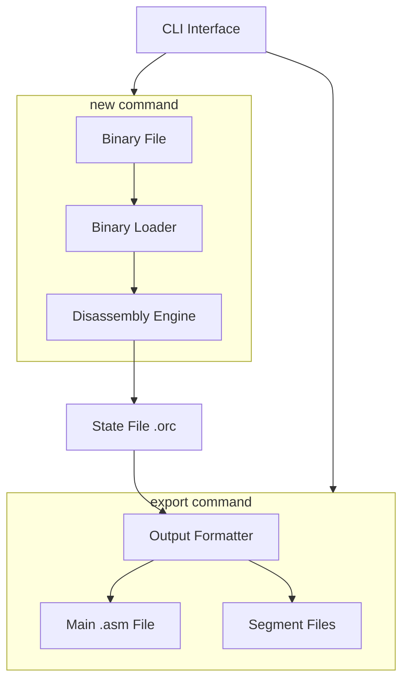

# Architecture Specification

This document specifies the core Go type definitions used throughout OpcodeOracle.

See [state-file.md](state-file.md) for the JSON file format specification.

## Program Flow



## Directory Structure

```
opcodeoracle/
├── cmd/
│   └── opcodeoracle/       # CLI entry point
│       └── main.go
├── internal/
│   ├── state/              # State types and file operations
│   ├── symbols/            # Symbol table implementation
│   ├── regions/            # Region table implementation
│   ├── annotations/        # Annotation table implementation
│   ├── xrefs/              # Cross-reference table implementation
│   ├── disasm/             # Disassembly engine
│   ├── loader/             # Binary file loaders
│   └── export/             # Assembly output formatter
├── spec/                   # Specification documents
├── testdata/               # Test binaries and fixtures
├── go.mod
└── README.md
```

| Directory                | Purpose                                        |
|--------------------------|------------------------------------------------|
| `cmd/opcodeoracle/`      | Main entry point, CLI argument parsing         |
| `internal/state/`        | State struct, JSON serialization, validation   |
| `internal/symbols/`      | Symbol types and SymbolTable interface         |
| `internal/regions/`      | Region types and RegionTable interface         |
| `internal/annotations/`  | Annotation types and AnnotationTable interface |
| `internal/xrefs/`        | XRef types and XRefTable interface             |
| `internal/disasm/`       | Flow-following disassembler, opcode decoding   |
| `internal/loader/`       | Binary file reading, PRG format handling       |
| `internal/export/`       | Assembly file generation, formatting           |
| `spec/`                  | Project specifications (this document)         |
| `testdata/`              | Test binaries and expected outputs             |

## Struct Definitions

### State

This struct maps directly to the JSON structure in state files (`.orc`). See [state-file.md](state-file.md) for the JSON serialization format.

```go
type State struct {
    Version     string
    Metadata    Metadata
    Binary      Binary
    EntryPoints []uint16
    Symbols     map[uint16][]Symbol
    Annotations map[uint16][]Annotation
    Regions     []Region
}
```

| Field         | Type                       | Description                                    |
|---------------|----------------------------|------------------------------------------------|
| `Version`     | string                     | Schema version (semver format)                 |
| `Metadata`    | Metadata                   | Project metadata                               |
| `Binary`      | Binary                     | Binary data and load parameters                |
| `EntryPoints` | []uint16                   | Entry point addresses                          |
| `Symbols`     | map[uint16][]Symbol        | See [symbol-table.md](symbol-table.md)         |
| `Annotations` | map[uint16][]Annotation    | See [annotation-table.md](annotation-table.md) |
| `Regions`     | []Region                   | See [regions-table.md](regions-table.md)       |

### Metadata

```go
type Metadata struct {
    Created     time.Time
    Modified    time.Time
    SourceFile  string
    Description string
}
```

### Binary

```go
type Binary struct {
    Data     []byte
    Origin   uint16
    Size     int
    Checksum string
}
```
