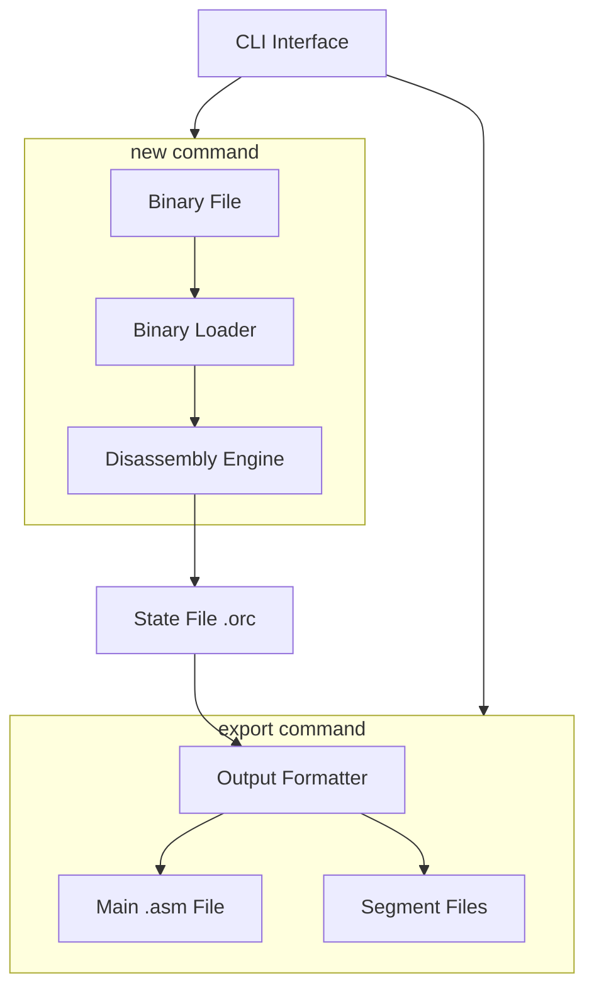

# OpcodeOracle - Project Specification

An agentic system for reverse engineering legacy computer code, focusing on MOS6502 assembler for the Commodore 64.

**Language:** Go

## Project Goals

1. Provide accurate disassembly of MOS6502 binary code
2. Use flow analysis to distinguish code from data
3. Generate readable, reassemblable output
4. Support agentic/AI-assisted reverse engineering workflows

## Architecture Overview

## Feature Roadmap

### Phase 1: Foundation

Core data structures and state management - must be implemented first.

| Feature                    | Status | Specification                      |
|----------------------------|--------|------------------------------------|
| Core type definitions      | Done   | [architecture.md](architecture.md) |
| State file format          | Done   | [state.md](state.md)               |
| MOS6502 opcode definitions | Done   | [opcodes.go](opcodes.go)           |

### Phase 2: State Interface Implementation

| Feature         | Status | Specification                            |
|-----------------|--------|------------------------------------------|
| State interface | Done   | [state-interface.md](state-interface.md) |

### Phase 3: Binary Reading & Disassembly

| Feature                    | Status  | Specification                      |
|----------------------------|---------|------------------------------------|
| Binary file reading        | Planned | [disassembler.md](disassembler.md) |
| Memory mapping             | Planned | [disassembler.md](disassembler.md) |
| Flow-following disassembly | Planned | [disassembler.md](disassembler.md) |
| Populate state from binary | Planned | [disassembler.md](disassembler.md) |

### Phase 4: Output Generation

Output assembly listing from state file. All output files include auto-generated headers.

| Feature                    | Status  | Specification              |
|----------------------------|---------|----------------------------|
| Auto-generated headers     | Planned | [export.md](export.md)     |
| Main disassembly file      | Planned | [export.md](export.md)     |
| Segment files              | Planned | [export.md](export.md)     |
| Data section hex dump      | Planned | [export.md](export.md)     |
| Symbol resolution          | Planned | [export.md](export.md)     |

### Phase 5: Enhanced Analysis

| Feature                | Status  | Specification        |
|------------------------|---------|----------------------|
| C64 ROM symbols        | Planned | [state.md](state.md) |
| C64 I/O register names | Planned | TBD                  |
| Cross-reference tables | Planned | [state.md](state.md) |
| Subroutine detection   | Planned | TBD                  |

### Phase 6: Agentic Features

| Feature                     | Status  | Specification |
|-----------------------------|---------|---------------|
| AI-assisted code annotation | Planned | TBD           |
| Pattern recognition         | Planned | TBD           |
| Automatic variable naming   | Planned | TBD           |
| Code structure analysis     | Planned | TBD           |

## Specification Documents

| Document                                   | Description                                |
|--------------------------------------------|--------------------------------------------|
| [overview.md](overview.md)                 | This file - project overview and roadmap   |
| [cli.md](cli.md)                           | Command line interface                     |
| [opcodes.go](opcodes.go)                   | MOS6502 instruction definitions            |
| [architecture.md](architecture.md)         | Core Go type and struct definitions        |
| [state.md](state.md)                       | JSON state file format for save/load       |
| [state-interface.md](state-interface.md)   | Go interface for state manipulation        |
| [symbol-table.md](symbol-table.md)         | Symbol types, struct, and interface        |
| [annotation-table.md](annotation-table.md) | Annotation struct and interface            |
| [segments-table.md](segments-table.md)     | Segment types, struct, and interface       |
| [disassembler.md](disassembler.md)         | Binary reading, parsing, and flow analysis |
| [export.md](export.md)                     | Assembly output format specification       |

## References

- [MOS6502 Programming Manual](http://archive.6502.org/books/mcs6500_family_programming_manual.pdf)
- [C64 Memory Map](https://sta.c64.org/cbm64mem.html)
- [C64 ROM Disassembly](https://www.pagetable.com/c64ref/c64disasm/)
